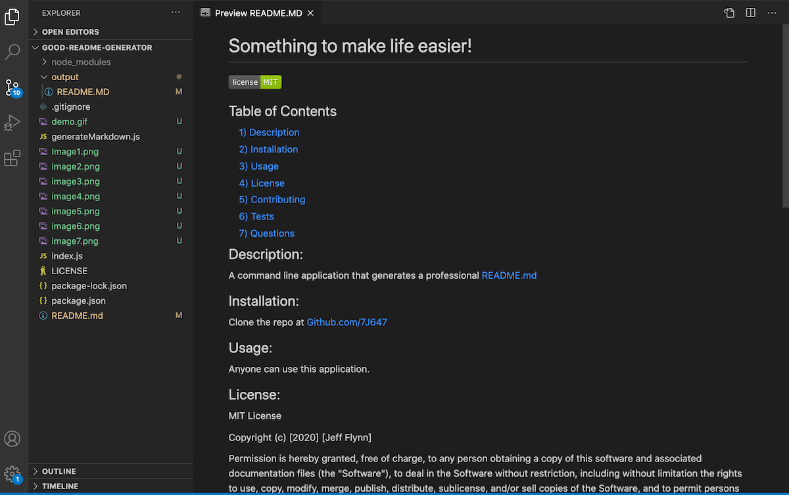

# Good-README-Generator

## Table of Contents
#### &nbsp;&nbsp;&nbsp;&nbsp;[1)&nbsp;Introduction](#introduction)
#### &nbsp;&nbsp;&nbsp;&nbsp;[2)&nbsp;Description](#description)
#### &nbsp;&nbsp;&nbsp;&nbsp;[3)&nbsp;Features](#features)
#### &nbsp;&nbsp;&nbsp;&nbsp;[4)&nbsp;Usage](#Usage-including-GitHub-Repository-URL-and-screenshots)
#### &nbsp;&nbsp;&nbsp;&nbsp;[5)&nbsp;Contributing](#contributing)
#### &nbsp;&nbsp;&nbsp;&nbsp;[6)&nbsp;License](#license)
#### &nbsp;&nbsp;&nbsp;&nbsp;[7)&nbsp;Questions](#questions)
    

## Introduction 

A quality README including detailed information about the app is an important element to any open source project on GitHub because users want to know details such as what the application is for, how it's used, how to install it if necessary, and how to report issues or make suggestions and other contributions to the project.  However due to simple human nature the README is often left until the end, a "last detail" that can always be put off while there is important (and more interesting) coding to be done!  Forgotten in all of that though is the fact that there is often a hard deadline.  Developers many times cannot just "get to it when they get to it."  It's not uncommon for a README to be quickly completed right before a submission deadline, which can end up hurting the overall project quality.

## Description

This project helps solve that problem by allowing a user to quickly and conveniently generate a quality README.  A command-line application has been created that dynamically populates a professional README from the user's input.  By simply typing "node index.js" into the command line, a series of prompts is generated on the command line with the goal of using the input from each prompt to populate its corresponding section of the README.  A user is asked to input information for Title, Description, Installation, Usage, Contributing, and Tests and these responses then are exported to the appropriate place. 

## Features

The user can also choose a license and have both the license and a badge be included in the README without even entering any text.  A dynamic table of contents is automatically included with internal links that allow a user to go straight to a particular section by clicking on the highlighted text.  By simply entering in a GitHub handle and an email address, dynamic links are generated that allow a user to make contact to report issues or offer suggestions.

## Usage including GitHub Repository URL and screenshots

To use this app, a user needs to go its GitHub repository and clone it into a folder on their own computer.  Once the folder is opened it is run from the command line beginning with "node index.js" as referenced.

The URL for this project's GitHub repository is: https://github.com/7J647/Good-README-Generator

 

<a href="https://drive.google.com/file/d/18HxnE2m2UYTqs_KaGCPCJVDosU6vITfl/view">Click here to view a demonstration video</a> 

## Contributing

With thanks to instructor Jonathan Watson and his team of TAs and to Josh Furlin for 
providing tutoring on this project.

## License

MIT License

Copyright (c) 2020 Jeff Flynn

Permission is hereby granted, free of charge, to any person obtaining a copy
of this software and associated documentation files (the "Software"), to deal
in the Software without restriction, including without limitation the rights
to use, copy, modify, merge, publish, distribute, sublicense, and/or sell
copies of the Software, and to permit persons to whom the Software is
furnished to do so, subject to the following conditions:

The above copyright notice and this permission notice shall be included in all
copies or substantial portions of the Software.

THE SOFTWARE IS PROVIDED "AS IS", WITHOUT WARRANTY OF ANY KIND, EXPRESS OR
IMPLIED, INCLUDING BUT NOT LIMITED TO THE WARRANTIES OF MERCHANTABILITY,
FITNESS FOR A PARTICULAR PURPOSE AND NONINFRINGEMENT. IN NO EVENT SHALL THE
AUTHORS OR COPYRIGHT HOLDERS BE LIABLE FOR ANY CLAIM, DAMAGES OR OTHER
LIABILITY, WHETHER IN AN ACTION OF CONTRACT, TORT OR OTHERWISE, ARISING FROM,
OUT OF OR IN CONNECTION WITH THE SOFTWARE OR THE USE OR OTHER DEALINGS IN THE
SOFTWARE.

## Questions

Connect with me at Github: <a href="https://github.com/7J647">7J647</a> &nbsp;&nbsp;&nbsp;&nbsp;
Contact me via Email: [jeffreyedwardflynn@gmail.com](mailto:jeffreyedwardflynn@gmail.com)
 